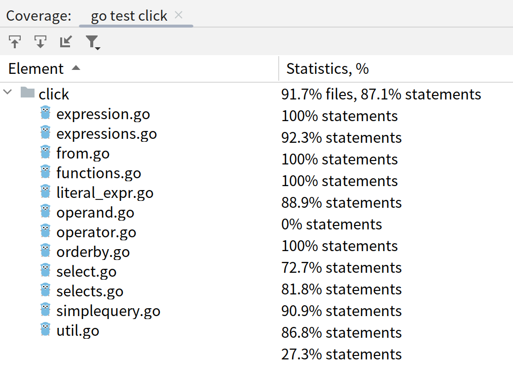

# click: Golang ClickHouse query SQL builder

[](https://pkg.go.dev/github.com/keuin/click)
[](https://goreportcard.com/report/github.com/keuin/click)

## 1. design overview

- **declarative builder**: build ClickHouse SQL declaratively, in simple or advanced ways
- **type-safe**: static-typed, extensible SQL template for code reuse
- **feel-like-home**: SQL-like, idiomatic Go, no bloated stuff
- **easy to extend & interoperate with**:
    + good interoperability with existing popular ORM library (`github.com/huandu/go-sqlbuilder`)
    + directly generate final query SQL, easy to use outside the library
- **well-tested**: test coverage ~87%
    + 

## 2. features & modules

1. `querybuilder`:
    + `SimpleQuery`: non-nested query shortcut, build with struct
    + `Select()`: declarative, chained, freestyle builder
2. `expression`: fundamental SQL expressions and operators
    + expressions & functions: `GreaterThan`, `LessThan`, `In`, `If`, ...
    + operators: `And`, `Or`, `Concatenate`

## 2. examples

### 2.1 click 101

```go
package main

import (
	"fmt"
	"github.com/keuin/click"
)

const (
	Date click.Column = "date"
	User click.Column = "user"
)

func main() {
	sumVisitCount := click.Alias("visit_count")
	sql, _ := click.
		Select(Date, User, click.As(click.Count(), sumVisitCount)).
		From(click.Table("user_accesses")).
		GroupBy(Date, User).
		OrderBy(sumVisitCount).
		Limit(10).PrettyPrint().BuildString()
	fmt.Println(sql)
}
```

```sql
SELECT
    date,
    user,
    count() AS visit_count
FROM
    user_accesses
GROUP BY
    date,
    user
ORDER BY
    visit_count
LIMIT
    10
```

### 2.2 nested query


```go
package main

import (
	"fmt"
	. "github.com/keuin/click"
)

const (
	Date  Column = "date"
	Score Column = "score"
	Tbl   Table  = "tbl"
)

func main() {
	avgScore := As(Avg(Score), LiteralExpression("avg_score"))
	sql, _ := Select(Count()).
		From(
			Select(avgScore).
				From(Tbl).
				Sample(0.1).
				Where(And(
					GreaterOrEqualThan(Date, LiteralExpressionQuoted("2024-01-01")),
					LessThan(Date, LiteralExpressionQuoted("2024-02-01")),
				)).
				GroupBy(Date).
				OrderBy(Date, Asc(Date), Desc(avgScore)).
				Having(GreaterThan(avgScore, LiteralExpression(60))).
				Limit(5).Offset(10),
		).
		PrettyPrint().BuildString()
	fmt.Println(sql)
}
```

```sql
SELECT
	count()
FROM
(
	SELECT
		avg(score) AS avg_score
	FROM
		tbl
	SAMPLE
		0.1
	WHERE
		((date >= '2024-01-01') AND (date < '2024-02-01'))
	GROUP BY
		date
	HAVING
		(avg_score > 60)
	ORDER BY
		date,
		date ASC,
		avg_score DESC
	LIMIT
		5
	OFFSET
		10
)
```
